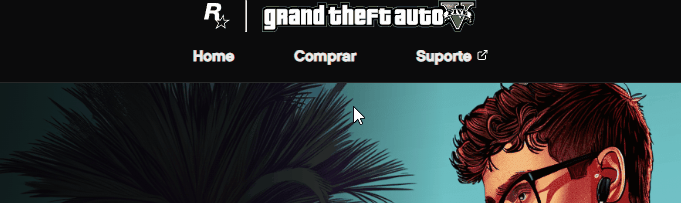

# Projeto com README
Um projeto de teste com um arquivo README👾

[](https://linefog.github.io/projeto-gta/)

## Tecnologias utilizadas
- HTML
- CSS
- JS

## Como Utilizar

1 - Clone o projeto
```
git clone <url>
```
 2 - Acesse a página do projeto
```
cd repositorio-com-readme <url>
```


